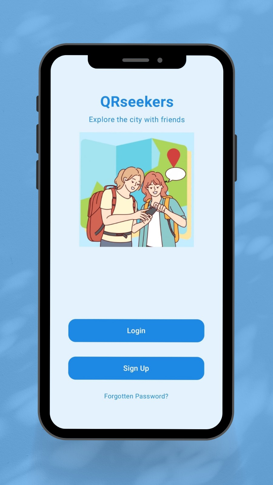

# QRseekers

QRseekers is an interactive app that invites you to explore cities in a fun and educational way. Scan QR codes hidden near landmarks, answer questions, and learn about local history, culture, and geography while competing to win. Can you conquer the challenge?

  

## **How it works**

1. **Create an account**: Sign up to start your adventure.  
2. **Choose a game**: Select a city-specific game with unique routes and challenges.  
3. **Follow the clues**: Head to the location provided by the app.  
4. **Scan and answer**: Find the QR code at the site, scan it, and answer the related questions.  
   - Answer all the questions correctly to win the game.  
   - If you fail, you can try again.  

&nbsp;

## **Key features**

### 1. **Exploration with QR Codes**  
- Players unlock challenges by scanning QR codes placed at specific landmarks in the city.  
- Each code triggers unique questions that connects to the local history and culture.

### 2. **Question system**  
- **Mandatory Questions**: Each location has questions that must be answered correctly to progress and win the game.  
- Questions include multiple-choice options.
  
### 3. **Game selection**  
- Choose from a variety of games, each tailored to a specific city or event.  
- Each game offers a unique set of clues, QR codes, and challenges, perfect for exploring and learning in a fun way.  

### 4. **Competition and progress**  
- Successfully answer all questions to win the game.  
- If you miss a mandatory question, you lose the challenge—but you can always try again.  

&nbsp;

## **User roles**

### **Player**  
- Registers on the app.  
- Selects and participates in games.  
- Scans QR codes and answers questions to complete the challenge.  

&nbsp;

## **Why QRseekers is unique**

- **Educational and fun**: Learn about the city while enjoying an exciting challenge.  
- **Easy to use**: Simply choose a game, follow the clues, and scan QR codes.  
- **Perfect for everyone**: Ideal for tourists, families, and urban adventurers.

  
