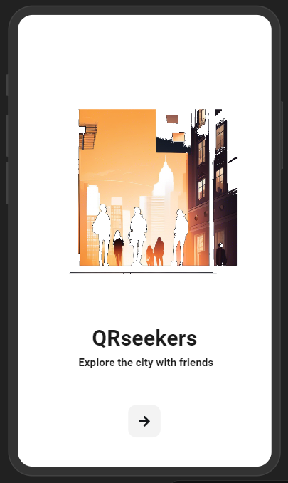

# QRseekers

The City Discovery Game app lets users explore cities by scanning QR codes hidden near landmarks. Each scanned code unlocks a set of questions—one mandatory and optional ones for bonus points—offering an engaging way to learn about local history, culture, and geography. The app tracks user progress, provides the next QR code location, and enables team-based play where one person answers questions on behalf of the entire team.

  

## Core Features

### 1. **Exploration & QR Codes**
- Players scan QR codes hidden near landmarks to trigger location-based questions.
- After answering, the app provides directions to the next QR code, guiding users through a sequence of city discoveries.

### 2. **Question System**
- **Obligatory Question**: Each location features one mandatory question that must be answered to progress.
- **Optional Questions**: Users can answer additional questions for bonus points, creating an optional competitive element. The answer can be number, string also multiple choice questions are allowed. Optionally picture answers with manual validation can be incorporated.
- **Catch the golden pig**: optionally there will be a open question for a password that can be obtained by catching a person "golden pig" in the city. 

### 3. **Team Play**
- **Single Response for Teams**: One team member answers questions on behalf of the entire team, and all members receive the same points.
- **Team Rankings**: Teams are ranked based on their total accumulated points.

### 4. **Game Selection**
- Players can choose from multiple city-specific games, each offering unique sets of QR codes and questions.
- Games can be downloaded for offline play, allowing users to explore without relying on an internet connection.

### 5. **Progress & Leaderboards**
- Real-time leaderboards show team rankings based on points earned. The board freezes for the last part of the game so the winner can be announced.
- Individual players can track their team’s overall progress and ranking.

### 6. **Customization & Scalability**
- The app can easily adapt to different cities by uploading new sets of QR codes and corresponding questions.
- Content creators or local partners can create new games for specific cities, events, or locations.
